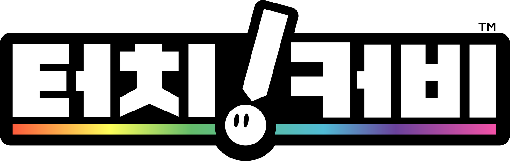

<p align="center">
  
</p>

# 터치! 커비 한글패치 툴

닌텐도 DS 「タッチ!カービィ」(일본판)를 한글화하는 패치 제작 도구입니다.

이 게임은 대사와 UI 텍스트가 **전부 그래픽(타일)** 으로 되어 있습니다. 그래서 이 도구는 다음 순서로 패치를 만듭니다.

1. 일본어 글자 그림을 지웁니다.
2. 한글 도트 폰트([갈무리](https://github.com/quiple/galmuri))로 글자를 다시 그립니다.
3. 원래 타일 용량 안에 다시 넣습니다.

번역 데이터와 타이틀 디자인이 함께 들어 있습니다. 일본판 ROM만 준비하면 명령 한 줄로 BPS 패치가 만들어집니다.

> 이 저장소에는 ROM이나 게임에서 뽑은 그래픽이 들어 있지 않습니다. 직접 가지고 있는 게임에서 추출한 ROM을 쓰세요.

## 결과물

- 한글화 그래픽 PNG 190장(편집 그룹 183개): 메뉴, 파일 선택, 레슨, 일시정지 설명, 트라이얼, 메달 체인저, 엔딩 자막, 타이틀 로고
- 교체 파일 258개, 모두 원래 타일 용량 이내
- `out/TouchKirby_KR.bps` (약 1MB)

## 준비물

- Python 3.9 이상
- Pillow: `pip install -r requirements.txt`
- 일본판 ROM `Touch! Kirby (Japan).nds`
  - SHA1 `8df7de7c8bfb302865398a9d9e0cff8a79e7c50d` (다른 버전이면 빌드가 중단됩니다)
- (선택) 미국판 ROM `Kirby - Canvas Curse (USA).nds`: 작업할 때 참고 이미지(`work/_us/`)만 만듭니다. 없어도 빌드됩니다.

## 빌드

```sh
pip install -r requirements.txt
# rom/ 폴더에 "Touch! Kirby (Japan).nds" 를 넣은 뒤
python tools/build.py
```

ROM이 다른 곳에 있으면 환경변수로 경로를 지정합니다.

```sh
KIRBY_JP_ROM="/경로/Touch! Kirby (Japan).nds" python tools/build.py
```

`build.py`는 아래 단계를 차례로 실행합니다. 한 단계라도 실패하면 거기서 멈춥니다.

| 단계 | 도구 | 내용 |
|---|---|---|
| 0 | `config.check_rom` | 일본판 ROM 확인 (SHA1) |
| 1 | `kpatch.py export --force` | 대상 그래픽을 `work/`에 인덱스 PNG로 추출 |
| 2 | `ktext.py render` | `translation/render/**/*.json` 사양대로 한글 글자 합성 |
| 3 | `import_art.py` | `assets/title/title_design.png` → 타이틀 화면 |
| 4 | `title_credit.py` | 타이틀 크레딧 문구 |
| 5 | `ktext.py check` | 원래 타일 용량 검사 (초과하면 빌드 중단) |
| 6 | `kpatch.py build` | `out/Touch Kirby (KR).nds`, `out/TouchKirby_KR.bps` 생성 (적용 검증 포함) |
| 7 | `verify.py` | 빌드한 ROM에서 그래픽을 다시 뽑아 `work/` PNG와 픽셀 단위로 비교 |

옵션:
- `--clean`: `work/`를 지우고 새로 시작합니다.
- `--no-title`: 타이틀 로고를 원본 그대로 둡니다.

## 패치 적용 (플레이하는 분)

1. 일본판 ROM(위 SHA1)을 준비합니다.
2. [Flips](https://github.com/Alcaro/Flips), [Rom Patcher JS](https://www.marcrobledo.com/RomPatcher.js/) 같은 BPS 패처로 `TouchKirby_KR.bps`를 적용합니다.
3. 에뮬레이터나 실기(플래시 카트, 3DS의 TWiLight Menu++ 등)에서 실행합니다.

## 폴더 구성

```
tools/        파이썬 도구
  build.py        한 번에 빌드
  config.py       경로 설정 (ROM 위치, 폴더)
  kpatch.py       추출(export) / 재삽입·ROM·BPS 생성(build) / 원본 재삽입 자체 검사(selftest)
  ktext.py        번역 사양 → 한글 합성(render), 비교 이미지(preview), 색·줄 분석(analyze), 용량 검사(check)
  import_art.py   외부 그림(타이틀 디자인) → 게임 팔레트 인덱스 PNG
  title_credit.py 타이틀 크레딧 문구
  title_smooth.py (선택) 안티앨리어싱 없는 로고의 곡선에 회색 AA 추가
  verify.py       빌드 결과 픽셀 검증
  review.py       원본/한글 나란히 보기 페이지(work/review.html)
  kasset.py       그래픽 그룹(chr·팔레트·스크린 묶음) 해석과 재삽입
  kfmt.py         그래픽 포맷 (05 셀 / 06 애니 / BG) 파싱·렌더·재구성
  ndslib.py       NDS 파일시스템, LZ77 압축/해제
  ndsrom.py       ROM 파일 교체, 헤더 CRC, BPS 생성·적용
  pngio.py        인덱스 PNG 읽기/쓰기 (의존성 없음)
  dump2.py, rominfo.py, romdiff.py   분석용 (일본판·미국판 비교 등)
data/targets.json      한글화 대상 파일 목록과 분류
translation/
  glossary.md          용어집 (나무위키 표기 기준)
  length_table_*.md    칸이 모자란 문구 표: 원문 | 자동번역 | 수기번역 | 메모
  draft_*.md           전체 번역 초안
  render/<bank>/*.json 그래픽마다 지우기·글자 찍기 사양 (186개)
assets/title/
  title_design.png     타이틀 디자인 (게임 팔레트로 내보낸 PNG-8)
  title_design.ai      원본 일러스트레이터 파일
  title_palette.act    타이틀 팔레트 (일러스트레이터 스와치용)
assets/logo/           README용 고화질 한글 로고 (logo.ai 원본, logo.png, logo_readme.png)
fonts/                 갈무리 폰트 (SIL OFL 1.1)
rom/                   ROM 넣는 곳 (git 제외)
work/, out/            빌드 중간 결과 / 결과물 (git 제외)
```

## 번역 고치기

### 문구 바꾸기
1. `translation/render/<bank>/<이름>.json`의 `text`를 고칩니다.
2. 결과를 확인합니다.

   ```sh
   python tools/ktext.py render <이름>
   python tools/ktext.py preview <이름> 3     # work/_preview/ 에 원본|결과 비교 이미지
   python tools/ktext.py check <이름>         # 타일 용량 확인
   python tools/build.py
   ```

`text`가 `"@L001"` 형태이면 `translation/length_table_*.md`의 해당 줄 값을 씁니다. `수기번역` 칸이 비어 있지 않으면 수기번역을, 비어 있으면 자동번역을 씁니다.

### 사양 형식
```jsonc
{
  "png": "bank04bin/allerasefilebutton.png",
  "ops": [
    {"clear": [x, y, w, h], "keep": [10, 3], "idx": 3},   // 영역에서 keep에 없는 색을 idx로 (글자 지우기)
    {"fill": [x, y, w, h], "idx": 10},                    // 사각형 채우기
    {"copy": [sx, sy, w, h], "to": [dx, dy]},             // 원본 영역 복사 (배경 무늬 복원)
    {"text": "예", "at": [x, y], "font": "g14", "fill": 8, "outline": 2,
     "shadow": [1, 1, 5], "align": "center", "w": 62, "valign_box": [1, 22],
     "spacing": 0, "line_h": 14, "bold": 2}
  ]
}
```
- 색은 팔레트 인덱스입니다. `python tools/ktext.py analyze <work PNG>`로 색과 글자 줄 위치를 볼 수 있습니다.
- 폰트: `g7`(8px), `g9`(10px), `g11`(12px), `g11b`(12px 굵게), `g11c`(12px 좁게), `g14`(15px)
- 줄바꿈은 `\n`입니다.

### 꼭 지킬 것 (실기 테스트로 확인한 제약)
- **원래보다 타일을 더 쓰면 게임에서 깨집니다.** 게임은 원래 크기만큼만 VRAM을 잡습니다. `ktext.py check`에서 `초과`가 나오면 글자를 줄이거나 자간·폰트를 바꾸세요. `build.py`는 초과가 있으면 빌드를 멈춥니다.
- 스프라이트 그래픽은 check가 `work/_preview/<이름>_objs.png`를 만듭니다. 같은 색·번호의 테두리는 원본에서 타일 블록을 공유하던 조각입니다. 한글도 똑같이 그려야 공유가 유지되어 용량이 맞습니다.
- **8x8 타일마다 16색 팔레트 뱅크는 하나만 씁니다.** 타일의 뱅크를 바꾸면 게임에서 깨질 수 있습니다. 타이틀의 무지개 뱅크는 팔레트 애니메이션으로 보입니다.

## 타이틀 디자인 고치기

1. `assets/title/title_design.ai`를 편집합니다.
   - 아트보드는 256×192(또는 그 정수배)입니다.
   - 스와치는 `title_palette.act`를 불러와 이 색만 씁니다.
2. PNG-8로 내보냅니다. 팔레트는 `title_palette.act`로 지정하고, 디더링 없이 저장합니다. 파일은 `assets/title/title_design.png`를 덮어씁니다.
3. `python tools/build.py`로 빌드합니다. `import_art.py`가 다음을 처리합니다.
   - 픽셀 칸 중심 샘플링
   - 팔레트 밖 회색 정리
   - 타일마다 원래 뱅크 유지(`--keep-bank`)
4. 8x8 타일 하나에는 한 뱅크의 색만 들어갑니다. 한 타일에 여러 뱅크의 색이 섞이면 가까운 색으로 바뀝니다. 회색이 거의 없는 뱅크(무지개 띠 줄 y 96~103)에서는 안티앨리어싱이 흑백으로 바뀝니다.

크레딧 문구는 `tools/title_credit.py`의 `TEXT`, `FONT`, `--y`로 바꿉니다.

## 포맷 메모

- **05 셀 컨테이너**: +04 색 수, +06 타일 수(bpp 단위), +08 셀 수, +0A 플래그(bit0 타일 영역 LZ77, bit14 8bpp), +0C/+10/+14 팔레트·타일·셀 오프셋
  - OAM은 8바이트입니다.
  - attr2 타일 번호 단위(128B/64B)는 자동으로 판별합니다.
  - 셀 오프셋은 순서대로 증가하지 않습니다. 각 셀은 "다음으로 큰 오프셋"에서 끝납니다.
- **06 애니 컨테이너**: 프레임마다 u16 크기 + 타일 블록
- **BG**: `chr_* + col_* + scr_*`
  - 팔레트는 이름 접두사로 찾습니다.
  - 팔레트가 512바이트면 8bpp입니다.
- **레슨 캔버스**(`z_chr_lessonNN_M`)는 공용 `z_chr_lesson`의 0x170번 타일부터 올라가는 16타일 폭 시트입니다.
- 압축은 LZ77(0x10)이고, VRAM 안전 모드로 압축합니다.
- ROM 파일은 제자리에 교체합니다. 커지면 ROM 끝에 붙이고 FAT와 헤더 CRC16을 고칩니다.

## 크레딧

- 한글화: WALNUT (2026)
- 폰트: [갈무리(Galmuri)](https://github.com/quiple/galmuri) by Lee Minseo (quiple), SIL Open Font License 1.1 (`fonts/Galmuri-LICENSE.txt`)
- 용어: [나무위키 「터치! 커비」](https://namu.wiki/w/%ED%84%B0%EC%B9%98!%20%EC%BB%A4%EB%B9%84) 문서의 한글 표기를 기준으로 했습니다.

## 면책

- 비공식 팬 번역입니다. 「タッチ!カービィ」와 관련 상표·저작권은 Nintendo / HAL Laboratory에 있습니다.
- 이 저장소는 ROM이나 게임 데이터를 배포하지 않습니다. 패치는 정품 게임을 가진 사람이 직접 적용하는 용도입니다.
